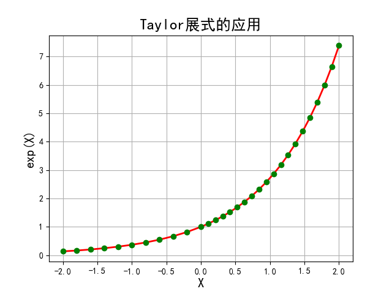
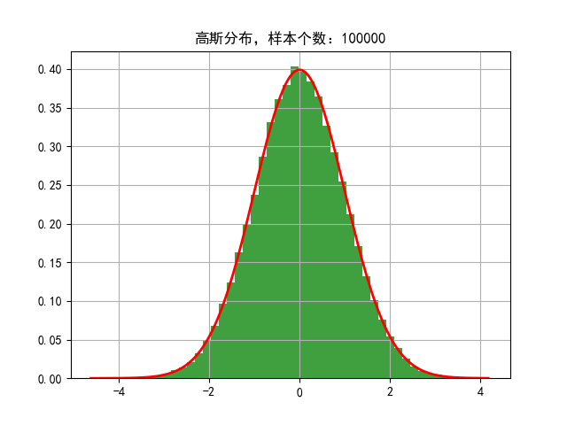

## Python Foundation
## (Python基础复习)

### 项目背景
>该项目是整合一些Python将在接下来机器学习项目实践的基础内容，主要是针对一些绘图函数库的使用实践，以及一些分布图及曲线手动绘制方法，方便接下来使用机器学习算法实现一些数据分析后进行可视化操作。

### 项目简介
|名称|简介|
|:-------------|:-------------:|
|1.1 intro|Python3.6的一些基础语言用法和知识点复习|
|1.2 calc_e|手动实现Taylor展开效果|
|1.3 class_intro|实践Python类函数继承特性|
|1.4 stat|Matplotlib绘制图像实践|

### 效果图
#### ·Taylor展开

#### ·手动堆积高斯分布

