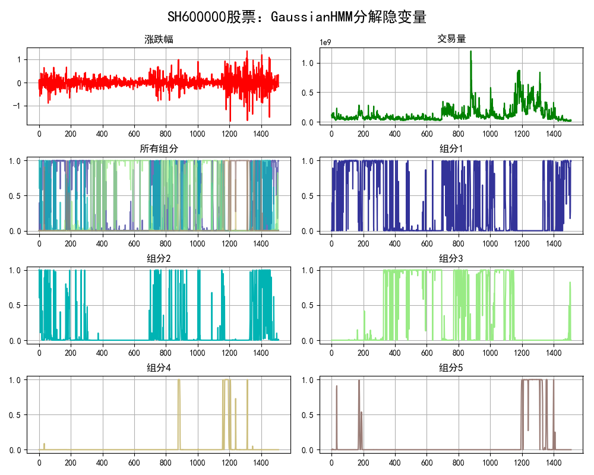

## Hidden Markov Model
## (隐马尔可夫模型)

### 项目背景
> 隐马尔可夫模型（Hidden Markov Model，HMM）是统计模型，它用来描述一个含有隐含未知参数的马尔可夫过程。其难点是从可观察的参数中确定该过程的隐含参数。然后利用这些参数来作进一步的分析，例如模式识别。是在被建模的系统被认为是一个马尔可夫过程与未观测到的（隐藏的）的状态的统计马尔可夫模型。其实对于HMM来说，如果提前知道所有隐含状态之间的转换概率和所有隐含状态到所有可见状态之间的输出概率，做模拟是相当容易的。但是应用HMM模型时候呢，往往是缺失了一部分信息的，有时候你知道骰子有几种，每种骰子是什么，但是不知道掷出来的骰子序列；有时候你只是看到了很多次掷骰子的结果，剩下的什么都不知道。如果应用算法去估计这些缺失的信息，就成了一个很重要的问题。

### 项目简介
|名称|简介|
|:-------------|:-------------:|
|11.1 TrainHMM|训练基本隐马尔可夫模型|
|11.2 Segmentation|分词实战|
|11.3 jieba_intro|jieba分词库基本引入|
|11.4 GMHMM|高斯混合分布隐马尔可夫模型|
|11.5 Stock|股票组分分析|

### 效果图
#### ·股票组分分析

