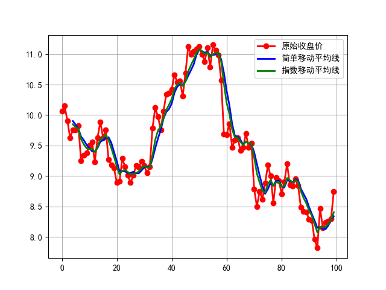
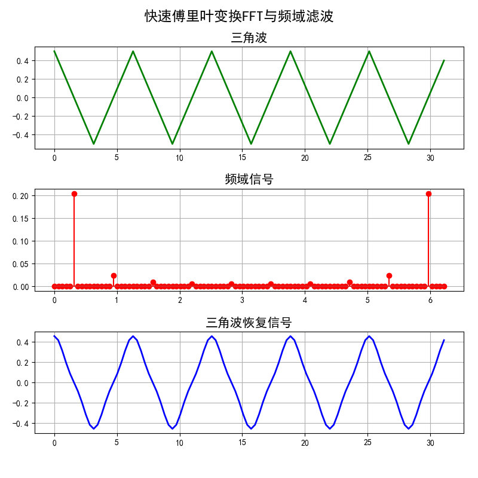
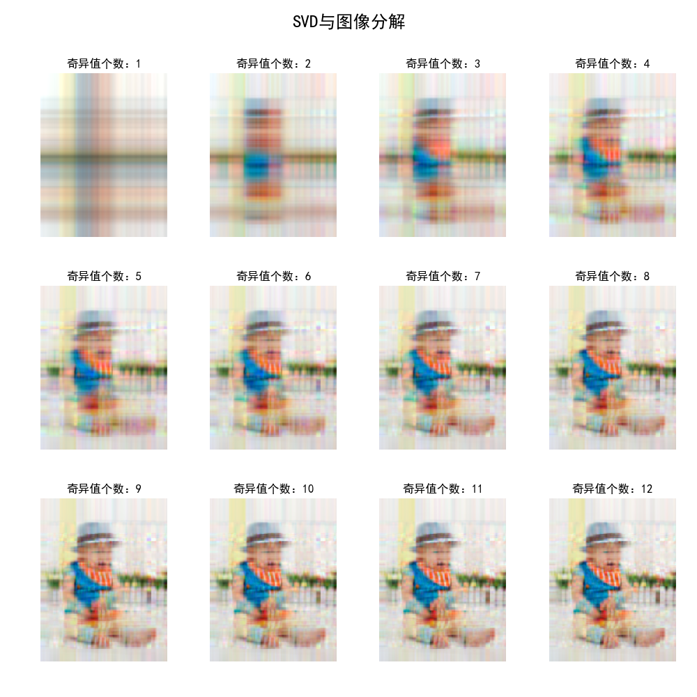

## Application Foundation
## (概念操作基础)

### 项目背景
>该项目是整合一些基础算法概念的操作实现，包括bagging操作效果好处，基本的滑动均值操作效果，以及一些SVD奇异值分解降维图像效果，比较零碎，但是可以以小窥大看到一些操作的数据呈现效果。

### 项目简介
|名称|简介|
|:-------------|:-------------:|
|2.1 Ensumble|二分类多次迭代后准确率可以拉升|
|2.2 Convolve|滑动均值实现股票曲线拟合|
|2.3 Image_convolve|基于不同算子的图像卷积轮毂勾勒|
|2.4 FFT|FFT傅里叶变化|
|2.5 SVD|SVD奇异值分解图像降维|

### 效果图
#### ·简易滑动均值拟合

#### ·指数滑动均值拟合

#### ·不同算子边界勾勒效果

#### ·时域信号&频域信号

#### ·傅里叶变化滤波操作

#### ·SVD奇异值分解图像压缩

