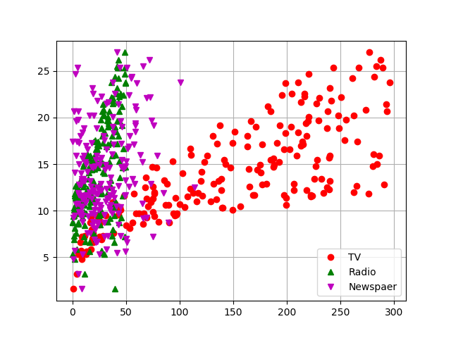
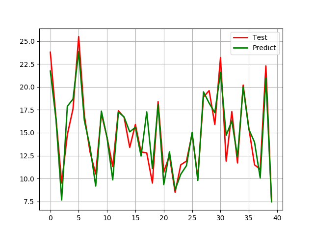
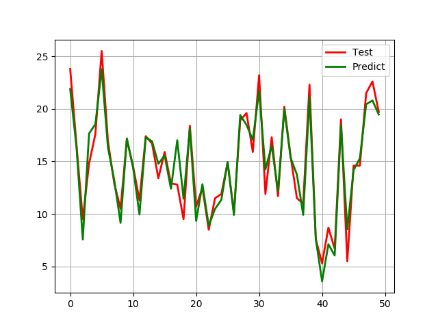
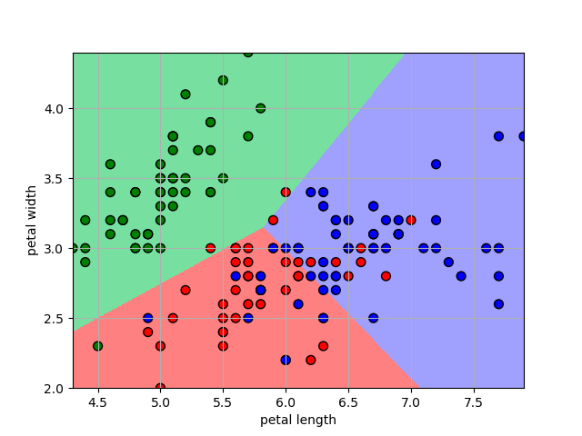
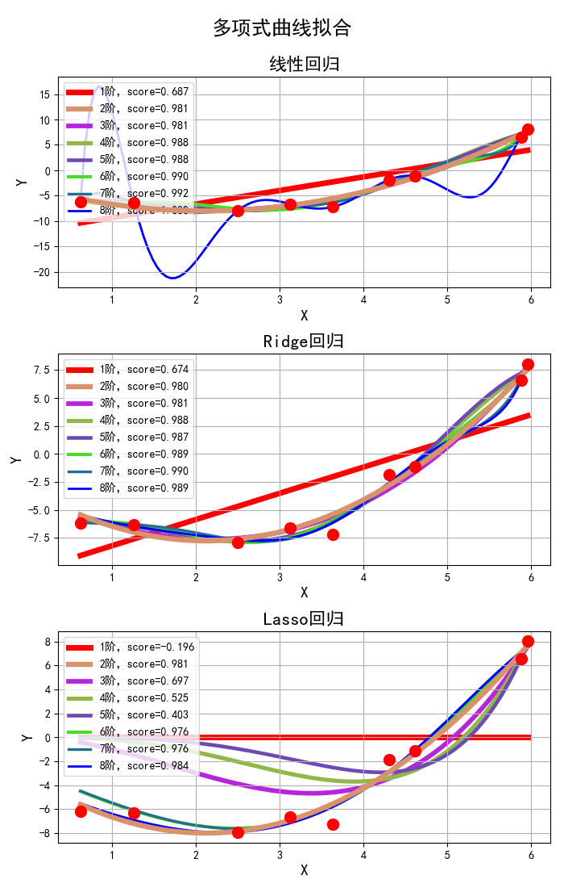

## Regression
## (回归)

### 项目背景
>该项目是整合一些基础回归算法，主要是线性回归应用。分别尝试将最简单的线性回归应用到广告投放数据集，以及莺尾花数据集。此外还引入了常用的cross validation交叉验证，尝试提升精度。最后实现了了非线性回归的拟合效果。在一些情况下会产生荣格现象，也就是过拟合现象，分别对应调参，调整过拟合和欠拟合效果。

### 项目简介
|名称|简介|
|:-------------|:-------------:|
|3.1 Advertising|广告投放数据集应用线性回归拟合预期收入|
|3.2 LinearRegression_CV|线性回归基础上引入交叉验证|
|3.3 Iris_LR|Iris莺尾花数据集引入线性回归分类花的种类|
|3.4 Overfit|非线性回归过拟合现象调整|

### 效果图
#### ·广告数据特征分布离散图

#### ·广告数据分布各自离散图

#### ·广告数据线性回归预测拟合

#### ·引入交叉验证的广告数据线性回归预测拟合

#### ·Iris莺尾花数据集应用线性回归分类

#### ·Overfit过拟合及荣格现象展示

