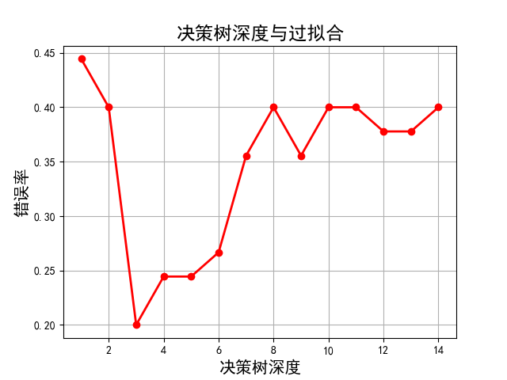
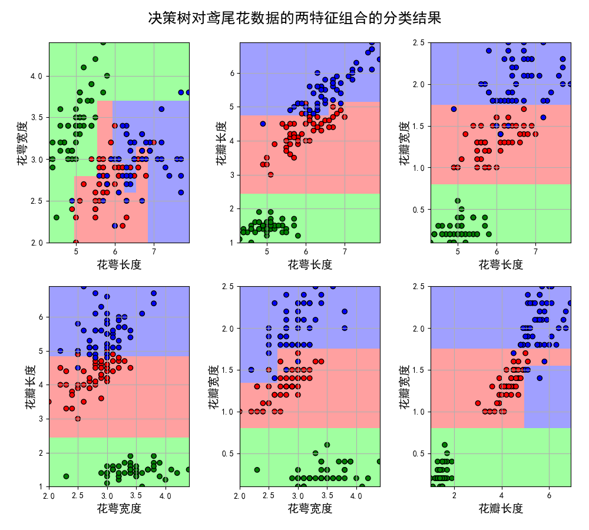
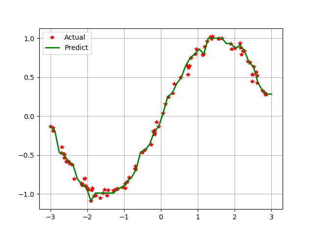
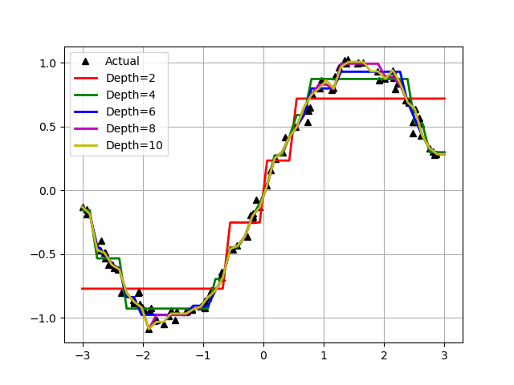
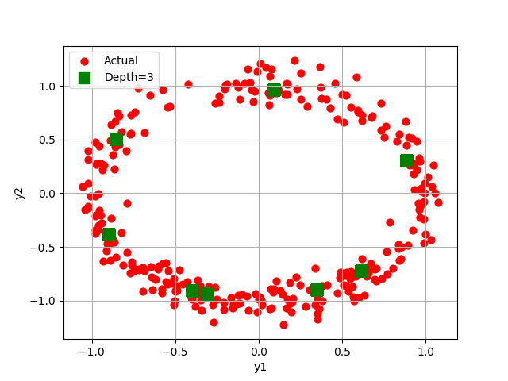
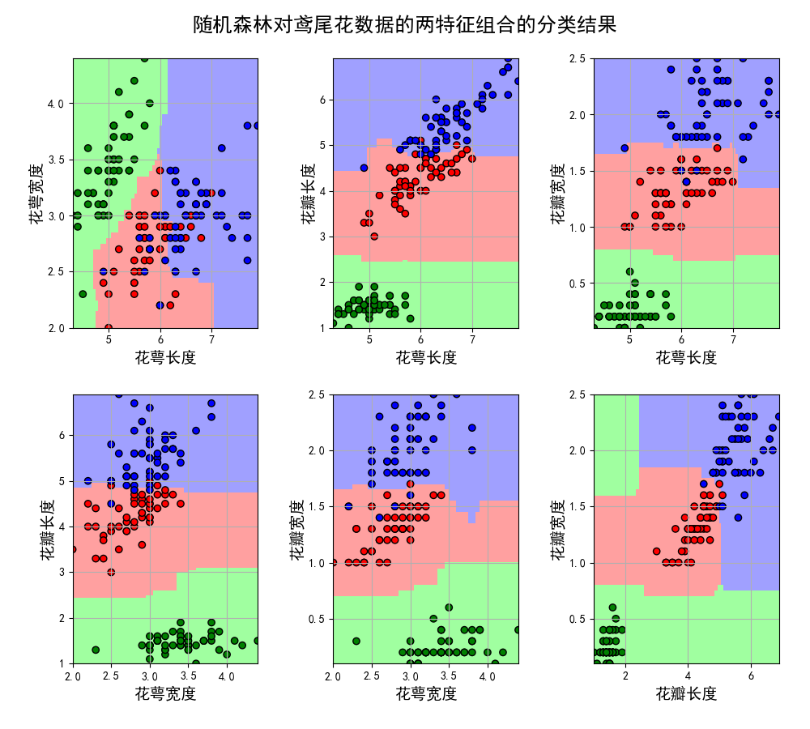

## Decision Tree & Random Forest
## (决策树 & 随机森林)

### 项目背景
> 决策树思想，实际上就是寻找最纯净的划分方法，这个最纯净在数学上叫纯度，纯度通俗点理解就是目标变量要分得足够开（y=1的和y=0的混到一起就会不纯）。另一种理解是分类误差率的一种衡量。实际决策树算法往往用到的是，纯度的另一面也即不纯度，下面是不纯度的公式。不纯度的选取有多种方法，每种方法也就形成了不同的决策树方法，比如ID3算法使用信息增益作为不纯度；C4.5算法使用信息增益率作为不纯度；CART算法使用基尼系数作为不纯度。尽管有剪枝等等方法，一棵树的生成肯定还是不如多棵树，因此就有了随机森林，解决决策树泛化能力弱的缺点。（可以理解成三个臭皮匠顶过诸葛亮）。

### 项目简介
|名称|简介|
|:-------------|:-------------:|
|4.1 Iris_DecisionTree|Iris莺尾花数据集决策树模型搭建|
|4.2 Iris_DecisionTree_Enum|决策树特征组合效果比较|
|4.3 DecisionTreeRegressor|决策树回归|
|4.4 MultiOutput_DTR|尝试不同深度对决策树的影响|
|4.5 Iris_RandomForest_Enum|随机森林模型搭建和特征选择比对|

### 效果图
#### ·决策树分类莺尾花数据效果

#### ·决策树深度对模型精度影响

#### ·决策树模型特征选择比较

#### ·树回归

#### ·不同深度的树回归效果比较

#### ·DTR

#### ·随机森林模型特征选择效果比较

