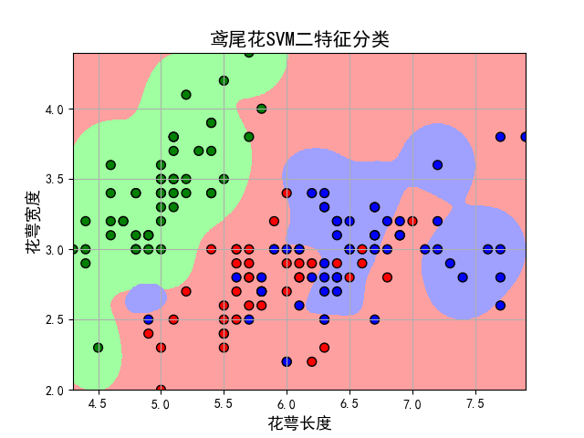
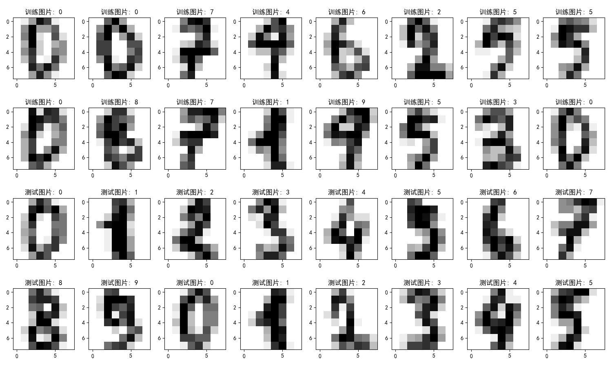
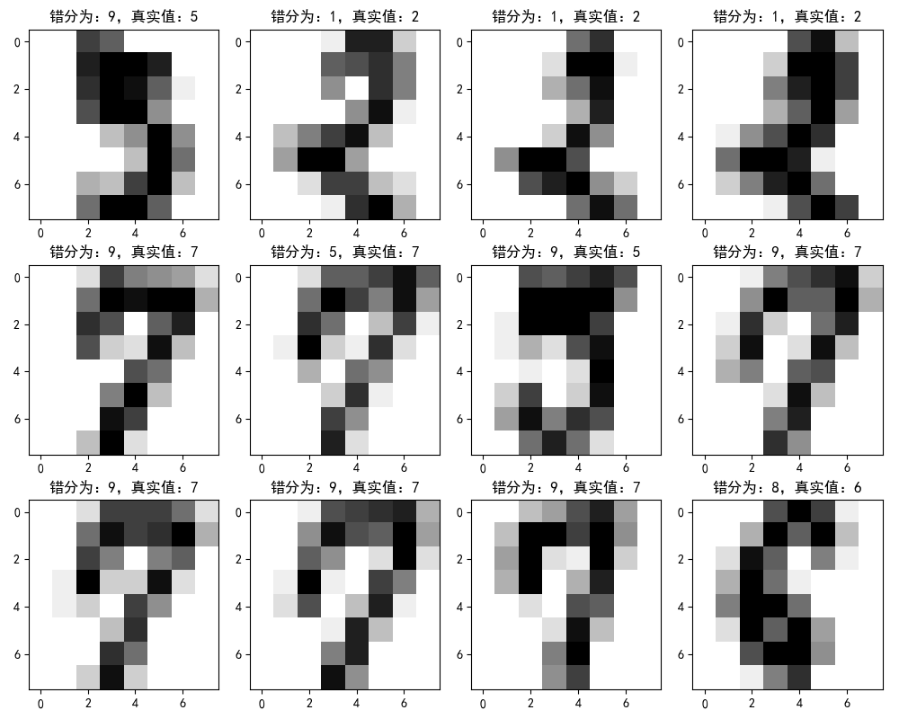
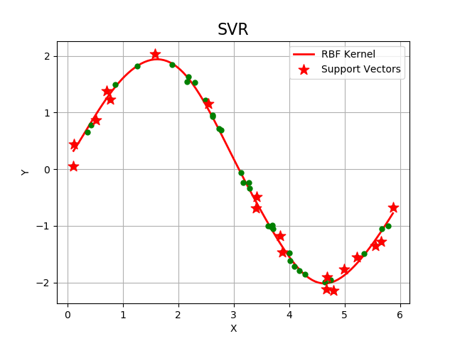

## SVM
## (支撑向量机)

### 项目背景
> SVM方法是通过一个非线性映射p，把样本空间映射到一个高维乃至无穷维的特征空间中（Hilbert空间），使得在原来的样本空间中非线性可分的问题转化为在特征空间中的线性可分的问题．简单地说，就是升维和线性化．升维，就是把样本向高维空间做映射，一般情况下这会增加计算的复杂性，甚至会引起“维数灾难”，因而人们很少问津．但是作为分类、回归等问题来说，很可能在低维样本空间无法线性处理的样本集，在高维特征空间中却可以通过一个线性超平面实现线性划分（或回归）．一般的升维都会带来计算的复杂化，SVM方法巧妙地解决了这个难题：应用核函数的展开定理，就不需要知道非线性映射的显式表达式；由于是在高维特征空间中建立线性学习机，所以与线性模型相比，不但几乎不增加计算的复杂性，而且在某种程度上避免了“维数灾难”．这一切要归功于核函数的展开和计算理论．

### 项目简介
|名称|简介|
|:-------------|:-------------:|
|6.1 SVM_intro|基于SVM算法莺尾花类别分类|
|6.2 SVM_draw|SVM基于不同超参数分类效果|
|6.3 ClassifierIndex|召回率等评价指标计算|
|6.4 unBalance|不平衡数据SVM分类处理效果|
|6.5 HandWrittenDigits|基于SVM手写体数字预测|
|6.6 SVR|不同核函数预测效果对比|
|6.7 CV|交叉验证配合SVM实现效果|

### 效果图
#### ·基于SVM算法莺尾花类别分类

#### ·SVM基于不同超参数分类效果

#### ·不平衡数据SVM分类处理效果

#### ·手写体数字数据集显示

#### ·手写体预测错误显示

#### ·不同核函数预测效果对比

#### ·交叉验证配合SVM实现效果

