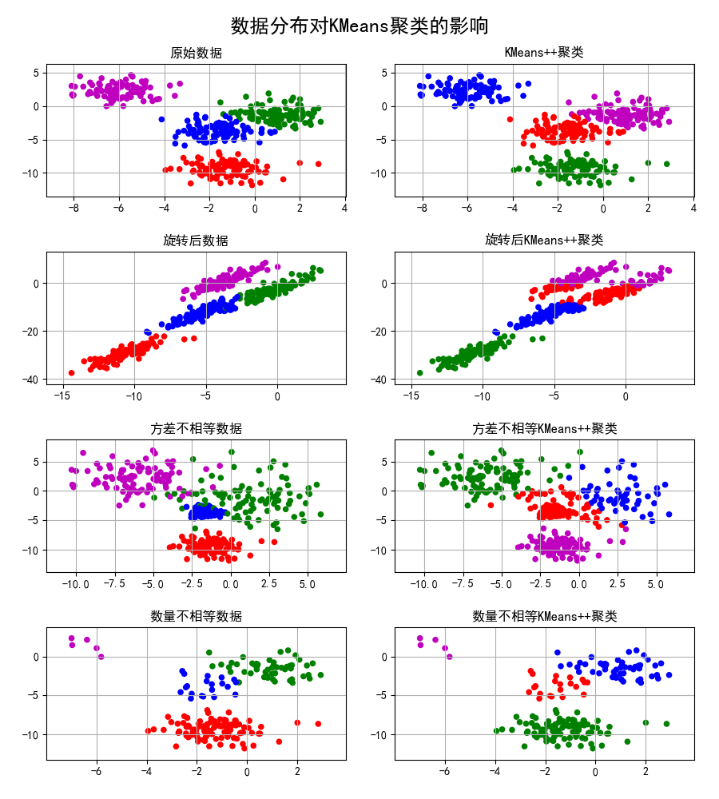
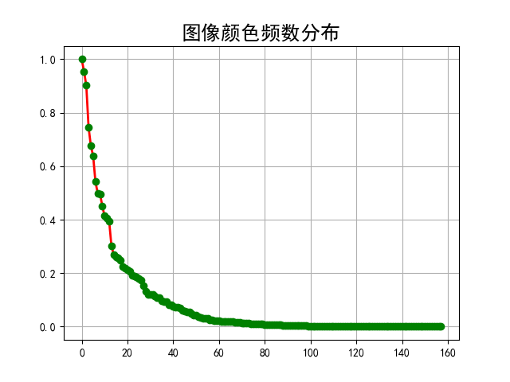
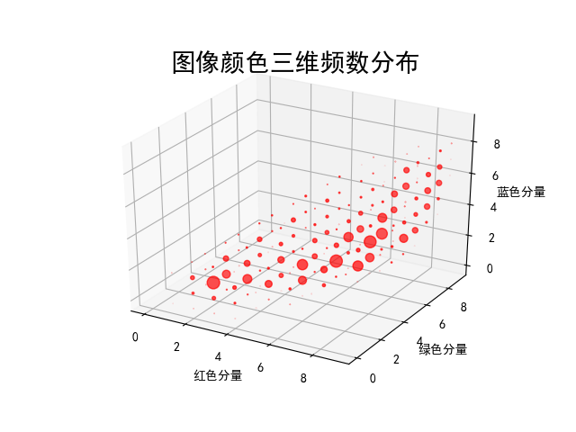
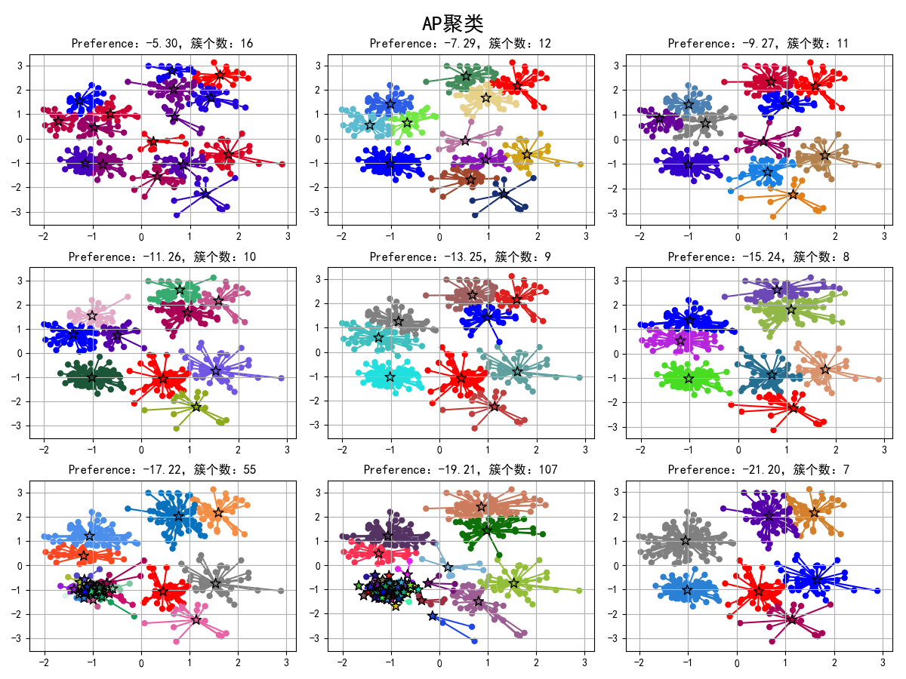
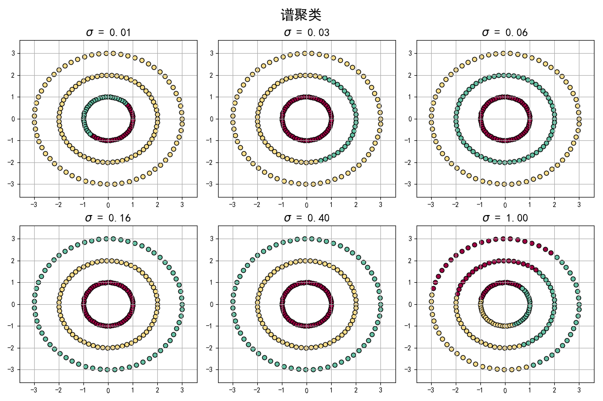

## Cluster
## (聚类算法)

### 项目背景
> 聚类就是对大量未知标注的数据集，按照数据内部存在的数据特征将数据集划分为多个不同的类别，使类别内的数据比较相似，类别之间的数据相似度比较小，属于无监督学习。聚类算法的重点是计算样本项之间的相似度，有时候也称为样本间的距离

### 基本步骤
(1)首先我们选择一些类/组，并随机初始化它们各自的中心点。中心点是与每个数据点向量长度相同的位置。这需要我们提前预知类的数量(即中心点的数量)。 
(2)计算每个数据点到中心点的距离，数据点距离哪个中心点最近就划分到哪一类中。 
(3)计算每一类中中心点作为新的中心点。 
(4)重复以上步骤，直到每一类中心在每次迭代后变化不大为止。也可以多次随机初始化中心点，然后选择运行结果最好的一个。 

### 项目简介
|名称|简介|
|:-------------|:-------------:|
|7.1 kMeans|基本聚类算法实现效果|
|7.2 criteria|验证聚类效果指标计算|
|7.3 VectorQuantization|矢量量化聚类压缩图像|
|7.4 AP|AP聚类|
|7.5 MeanShift|MeanShift聚类|
|7.6 DBSCAN|DBSCAN聚类|
|7.7 SC|谱聚类|
|7.8 SpectralClusterImage|谱聚类应用效果|

### 效果图
#### ·基本聚类算法实现效果

#### ·矢量量化聚类压缩图像

#### ·矢量量化二维分布

#### ·矢量量化三维分布

#### ·AP聚类

#### ·MeanShift聚类

#### ·DBSCAN聚类

#### ·谱聚类

#### ·谱聚类应用效果

