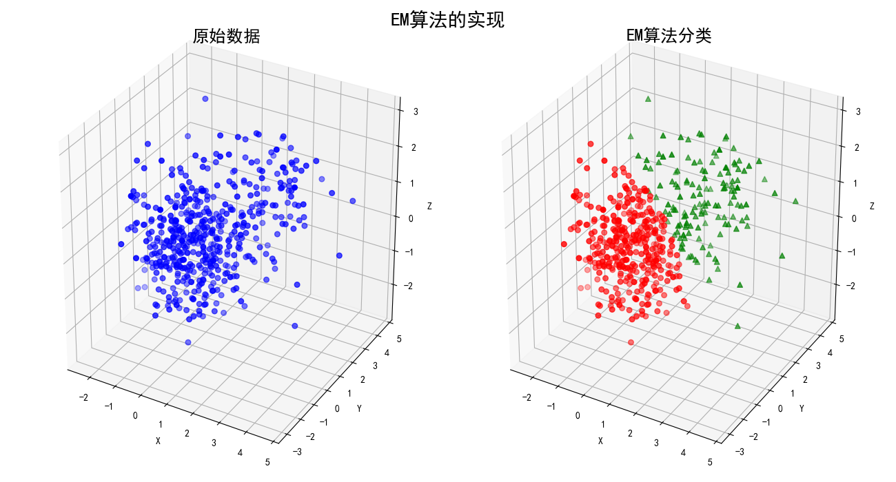
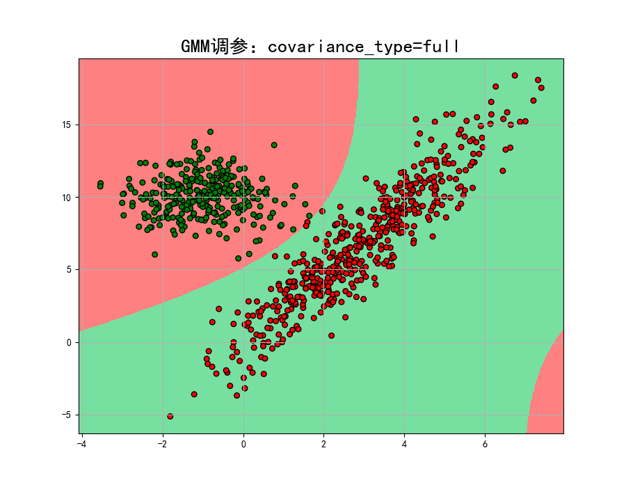
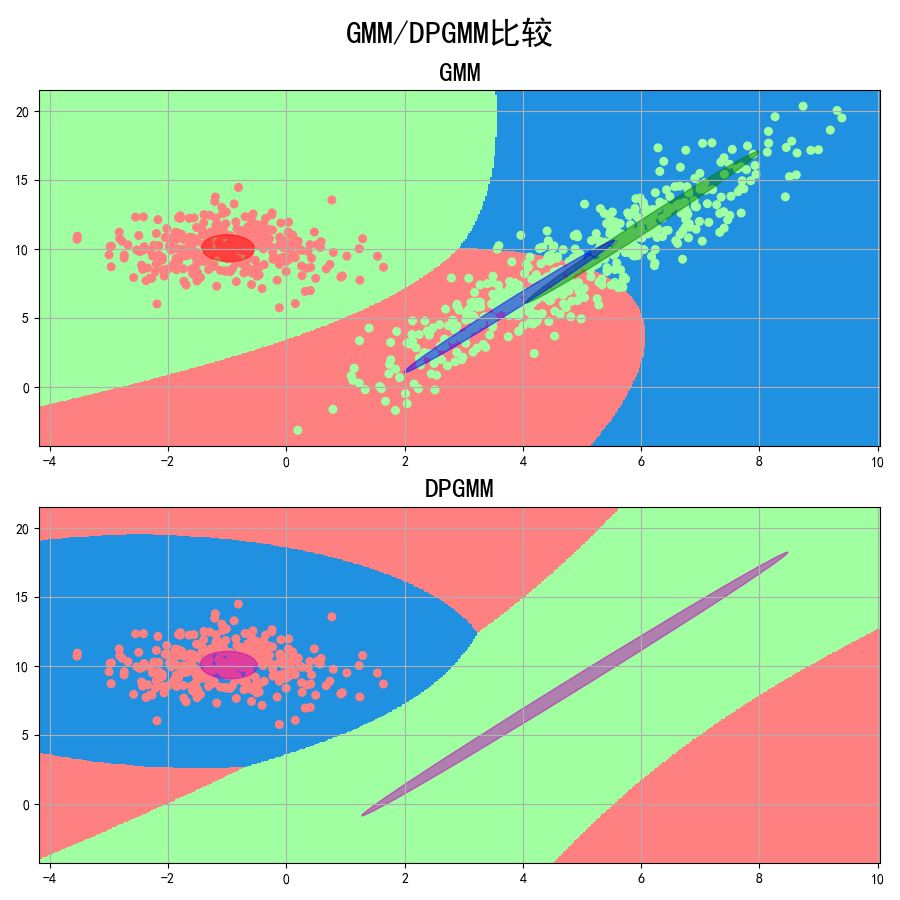
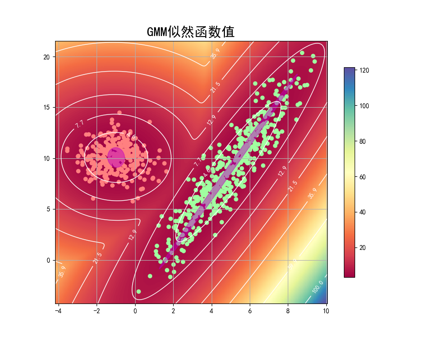

## EM Model
## (Expectation Maximization Algorithm)

### 项目背景
> EM算法是一种迭代优化策略，由于它的计算方法中每一次迭代都分两步，其中一个为期望步（E步），另一个为极大步（M步），所以算法被称为EM算法（Expectation Maximization Algorithm）。EM算法受到缺失思想影响，最初是为了解决数据缺失情况下的参数估计问题，其算法基础和收敛有效性等问题在Dempster，Laird和Rubin三人于1977年所做的文章Maximum likelihood from incomplete data via the EM algorithm中给出了详细的阐述。其基本思想是：首先根据己经给出的观测数据，估计出模型参数的值；然后再依据上一步估计出的参数值估计缺失数据的值，再根据估计出的缺失数据加上之前己经观测到的数据重新再对参数值进行估计，然后反复迭代，直至最后收敛，迭代结束。

### 项目简介
|名称|简介|
|:-------------|:-------------:|
|8.1 EM|EM算法基本应用|
|8.2 GMM|EM算法估算高斯混合模型参数|
|8.3 GMM_Parameter|比较不同方差类型错误率|
|8.4 GMM_Iris|EM算法应用到Iris莺尾花数据|
|8.5 DPGMM|DPGMM与GMM模型比较|
|8.6 GMM_pdf|GMM最大似然函数值|

### 效果图
#### ·EM算法基本应用

#### ·EM算法估算高斯混合模型参数

#### ·比较不同方差类型错误率

#### ·GMM调参

#### ·EM算法应用到Iris莺尾花数据

#### ·DPGMM与GMM模型比较

#### ·GMM似然函数值

