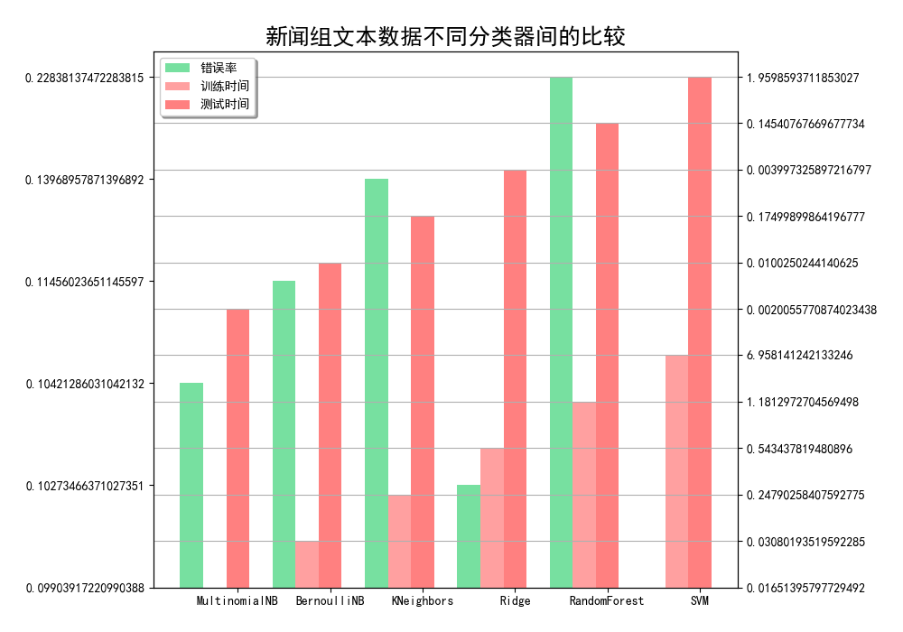

## Bayes Network
## (贝叶斯网络)

### 项目背景
> 托马斯·贝叶斯（Thomas Bayes）同学的详细生平在这里。以下摘一段 wikipedia上的简介：所谓的贝叶斯方法源于他生前为解决一个“逆概”问题写的一篇文章，而这篇文章是在他死后才由他的一位朋友发表出来的。在贝叶斯写这篇文章之前，人们已经能够计算“正向概率”，如“假设袋子里面有N个白球，M个黑球，你伸手进去摸一把，摸出黑球的概率是多大”。而一个自然而然的问题是反过来：“如果我们事先并不知道袋子里面黑白球的比例，而是闭着眼睛摸出一个（或好几个）球，观察这些取出来的球的颜色之后，那么我们可以就此对袋子里面的黑白球的比例作出什么样的推测”。这个问题，就是所谓的逆概问题。实际上，贝叶斯当时的论文只是对这个问题的一个直接的求解尝试，并不清楚他当时是不是已经意识到这里面包含着的深刻的思想。然而后来，贝叶斯方法席卷了概率论，并将应用延伸到各个问题领域，所有需要作出概率预测的地方都可以见到贝叶斯方法的影子，特别地，贝叶斯是机器学习的核心方法之一。这背后的深刻原因在于，现实世界本身就是不确定的，人类的观察能力是有局限性的，我们日常所观察到的只是事物表面上的结果，沿用刚才那个袋子里面取球的比方，我们往往只能知道从里面取出来的球是什么颜色，而并不能直接看到袋子里面实际的情况。这个时候，我们就需要提供一个猜测（hypothesis，更为严格的说法是“假设”，这里用“猜测”更通俗易懂一点），所谓猜测，当然就是不确定的（很可能有好多种乃至无数种猜测都能满足目前的观测），但也绝对不是两眼一抹黑瞎蒙——具体地说，我们需要做两件事情：1. 算出各种不同猜测的可能性大小。2. 算出最靠谱的猜测是什么。第一个就是计算特定猜测的后验概率，对于连续的猜测空间则是计算猜测的概率密度函数。第二个则是所谓的模型比较，模型比较如果不考虑先验概率的话就是最大似然方法。

### 项目简介
|名称|简介|
|:-------------|:-------------:|
|9.1 Iris_GaussianNB|高斯朴素贝叶斯模型预测Iris莺尾花数据集|
|9.2 MultinomialNB_intro|多项式朴素贝叶斯基础应用|
|9.3 text_classification|基于TF-IDF文本特征提取用贝叶斯模型分类文本|

### 效果图
#### ·高斯朴素贝叶斯模型预测Iris莺尾花数据集效果

#### ·不同模型进行文本分类效果比对

